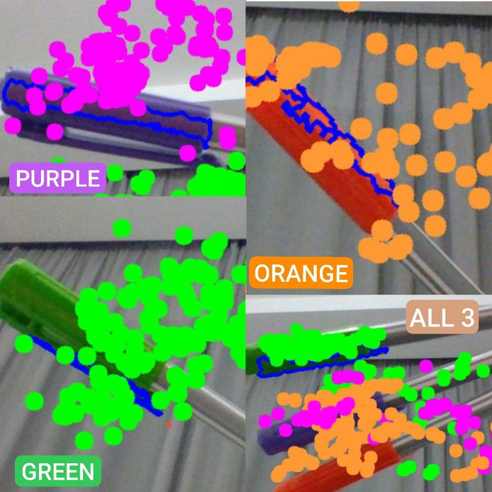

## Color Detection Using OpenCV🎨🔍

## Overview

This project utilizes OpenCV and NumPy to detect and track specific colors in real-time from a webcam feed. It identifies objects of predefined colors (orange, purple, and green) based on their HSV (Hue, Saturation, Value) color ranges. The program then marks the detected objects and tracks their movement.
Features

    Real-time color detection and tracking using HSV color filtering
    Contour detection to accurately locate objects of interest
    Dynamic tracking and drawing of detected objects on the screen
    Configurable color ranges for easy customization

## Project Structure

📂 Color-Detection-OpenCV  
│-- 📜 Color_Picker.py   # (Optional) Tool to fine-tune HSV values  
│-- 📜 color_detection.py   # Main script for color detection  
│-- 📜 README.md   # Documentation  

## How It Works

    Webcam Capture: The script initializes the webcam and captures video frames in real-time.
    Color Space Conversion: Each frame is converted from BGR to HSV color space, which is more suitable for color-based filtering.
    Color Filtering: A mask is created based on predefined HSV thresholds to isolate specific colors.
    Contour Detection: The program identifies the contours of detected colors and determines their positions.
    Tracking & Visualization: A colored marker is drawn at the detected position, and the object's movement is tracked.

## Customization
Adding More Colors

To detect additional colors, update the myColors list with new HSV values:

myColors = [
    [H_min, S_min, V_min, H_max, S_max, V_max],  # Add new color range
]

Also, define a corresponding BGR color value in myColorValues:

myColorValues.append([B, G, R])  # Specify marker color

## Adjusting HSV Values

To fine-tune detection accuracy, use Color_Picker.py, which provides an interface with trackbars for real-time adjustments.
Potential Improvements

    Implement shape detection (e.g., circles, squares, and rectangles)
    Introduce a drawing mode where detected objects leave a trail
    Enhance detection robustness with adaptive thresholding or machine learning-based segmentation

## Demo  
Below is an example of the color detection in action:

